# Product Requirements Document (PRD)
## SAPA SOSIAL — Satu Pintu Layanan Sosial Kabupaten Blitar

| | |
|--|--|
| **Nama Sistem** | SAPA SOSIAL — Satu Pintu Layanan Sosial Kabupaten Blitar |
| **Tanggal** | 23 September 2026 (revisi 24 September 2026) |
| **Penyusun** | Ahmad Mu'amar Muzakki — Penelaah Teknis Kebijakan |
| **Instansi** | Dinas Sosial Kabupaten Blitar |
| **Teknologi** | Laravel · Filament v5 · Livewire v4 · PostgreSQL |

---

## Ringkasan Sistem

Dinas Sosial Kabupaten Blitar membutuhkan sistem digital terpadu untuk mengelola layanan sosial, dengan prioritas pada tiga layanan yang paling sering diakses masyarakat: **Surat Keterangan DTSEN, Reaktivasi KIS/PBI-JK, dan Pelayanan Rehabilitasi Sosial**, dilengkapi pengaduan sosial dan portal informasi layanan. Sistem ini memudahkan masyarakat mengajukan layanan, menyampaikan pengaduan, dan memantau perkembangan secara online menggunakan nomor tiket; membantu petugas menerima, memverifikasi, mendisposisikan, dan memproses layanan secara terorganisir; serta memberikan dashboard dan laporan real-time bagi pimpinan. Target: mengubah proses layanan yang tersebar dan sulit dilacak menjadi **satu pintu layanan yang setiap tahapannya tercatat dan dapat ditelusuri dari awal sampai selesai**.

---

## Konteks Teknis

| Komponen | Teknologi | Keterangan |
|----------|-----------|------------|
| Framework backend | **Laravel** (versi stabil terbaru, minimal 11.28) | Syarat minimal Filament v5 |
| Bahasa | **PHP 8.3+** | Filament v5 mensyaratkan PHP 8.2+; disarankan 8.3+ agar sejalan dengan Laravel terbaru |
| Panel admin & back-office | **Filament v5** — https://filamentphp.com/ | Resources, Schemas (form & infolist), Tables, Actions, Widgets, Notifications |
| Reaktivitas UI | **Livewire v4** | Dipakai Filament v5 dan untuk halaman portal publik |
| Styling | **Tailwind CSS v4** + Alpine.js | Bawaan ekosistem Filament v5 (TALL stack) |
| Database | **PostgreSQL** (disarankan versi 16 atau lebih baru) | Lihat konvensi khusus PostgreSQL di Bagian 4.1 |
| Paket pendukung | spatie/laravel-permission, spatie/laravel-activitylog, ekspor Excel (mis. Filament Export Action / maatwebsite/excel), PDF (mis. barryvdh/laravel-dompdf atau spatie/laravel-pdf), QR code (mis. simplesoftwareio/simple-qrcode) | Pilihan paket final boleh disesuaikan asalkan kompatibel dengan Filament v5 / Livewire v4 |
| Antrean & penjadwalan | Laravel Queue (driver `database`) + Scheduler | Untuk generate PDF, ekspor laporan besar, dan penanda tiket tertahan |
| Penyimpanan file | Laravel Filesystem, disk `local` privat (dapat dipindah ke S3-compatible/MinIO) | Dokumen pribadi tidak boleh di disk publik |

**Arsitektur aplikasi:**
- **Panel Admin Filament** (`/admin`) — untuk Administrator, Petugas Dinsos, Pejabat Penandatangan, Pimpinan, dan Operator Kecamatan/Desa. Menu dan data yang tampil diatur oleh role & Policy.
- **Portal Publik** (`/`) — dibangun dengan **komponen Livewire v4** (full-page components) bergaya Tailwind CSS: informasi layanan, formulir pengajuan & pengaduan, cek status tiket, verifikasi keaslian SK DTSEN, serta area akun masyarakat. Formulir boleh memakai Filament Schemas di dalam komponen Livewire.
- Satu aplikasi Laravel (monolit modular), satu database PostgreSQL.

---

## 1. Pengguna Sistem

| Peran | Siapa | Yang Mereka Lakukan |
|-------|-------|---------------------|
| **Administrator** | Pengelola sistem Dinas Sosial | Kelola pengguna & hak akses, data master (jenis layanan, persyaratan, tujuan SK DTSEN, kategori, wilayah, lembaga rujukan), konten informasi, dan seluruh sistem |
| **Petugas Dinsos** | Staf pelayanan / rehabilitasi sosial | Memeriksa, memverifikasi (termasuk cek data di SIKS-NG), mendisposisikan, dan memproses pengajuan, pengaduan, dan kasus rehabilitasi; mencatat assessment, tindakan, dan monitoring |
| **Pejabat Penandatangan** | Kepala Bidang / Kepala Dinas | Memeriksa (paraf) dan menyetujui/menandatangani SK DTSEN dan surat rekomendasi reaktivasi PBI-JK |
| **Pimpinan** | Kepala Dinas / pejabat terkait | Melihat dashboard, statistik, dan laporan — hanya baca |
| **Operator Kecamatan/Desa** | Petugas/operator kecamatan, desa, atau Puskesos | Membantu warga mengajukan layanan/pengaduan, memberikan informasi awal, memantau pengajuan di wilayahnya |
| **Masyarakat** | Warga Kabupaten Blitar | Melihat informasi layanan, mengajukan layanan, menyampaikan pengaduan, dan cek status menggunakan nomor tiket |

> Satu akun dapat memiliki lebih dari satu peran (mis. Kepala Dinas = Pimpinan + Pejabat Penandatangan).

---

## 2. Layanan yang Dikelola Sistem

> **Catatan struktur:** Layanan 1, 2, dan 4 berjalan di atas **mekanisme pengajuan yang sama** (nomor tiket, dokumen persyaratan, verifikasi, riwayat status — tabel `service_requests`). Layanan 1 dan 2 memiliki **data tambahan khusus** (tabel `dtsen_certificates` dan `pbi_reactivations`). Layanan 3 dapat berasal dari pengajuan (Layanan 4), pengaduan (Layanan 5), atau diterima langsung oleh petugas.

---

### Layanan 1 — Surat Keterangan DTSEN ⭐ *Prioritas*

**Deskripsi:** Penerbitan surat keterangan yang menerangkan status seseorang/keluarga dalam Data Tunggal Sosial Ekonomi Nasional (DTSEN), termasuk peringkat desil. Umumnya dipakai sebagai syarat SPMB jalur afirmasi, PIP, KIP Kuliah, bantuan sosial, dan layanan kesehatan. Petugas mengecek data pemohon di SIKS-NG, lalu surat diterbitkan setelah disetujui pejabat penandatangan.

**Alur:**
1. Masyarakat/operator memilih layanan "Surat Keterangan DTSEN" dan memilih **tujuan penggunaan** (SPMB, PIP, KIP Kuliah, bansos, kesehatan, lainnya)
2. Mengisi data pemohon dan data **orang yang diterangkan** (mis. anak/calon siswa), lalu mengunggah KTP dan KK
3. Sistem membuat nomor tiket
4. Petugas memeriksa kelengkapan berkas (bila kurang → diminta perbaikan)
5. Petugas mengecek data di **SIKS-NG** dan mencatat hasilnya: terdaftar/tidak, desil, tanggal pengecekan
6. Jika memenuhi ketentuan tujuan penggunaan, sistem membuat **draf surat** otomatis dari template
7. Kepala Bidang memeriksa dan memberi paraf; Kepala Dinas menyetujui/menandatangani
8. Sistem menerbitkan **nomor surat** dan file PDF bertanda **kode verifikasi/QR**
9. Pemohon mengunduh surat atau mengambilnya di kantor; tiket selesai

**Urutan status:** `submitted` → `document_check` → (`revision_requested` ↺ `submitted`) → `data_verification` → `awaiting_approval` → `issued` → `completed`. Status akhir alternatif: `rejected` (mis. tidak terdaftar / desil di luar ketentuan).

**Data yang dicatat:** nomor tiket · nama, NIK, No. KK, alamat, desa/kelurahan, kecamatan, No. HP pemohon · nama & NIK orang yang diterangkan · hubungan dengan pemohon · tujuan penggunaan · keterangan tujuan · dokumen KTP & KK · hasil cek SIKS-NG (terdaftar/tidak, desil, tanggal cek, petugas pengecek) · nomor surat · tanggal terbit · pejabat penandatangan · file surat · kode verifikasi · riwayat paraf/persetujuan · riwayat status

**Aturan bisnis:**
- Persyaratan minimal: **KTP dan KK** (daftar persyaratan dapat diubah admin per jenis layanan)
- Setiap tujuan penggunaan memiliki **batas desil maksimal yang dapat diatur admin** (mis. SPMB/PIP: desil 1–5); surat hanya dapat diterbitkan jika desil hasil cek ≤ batas tersebut
- Hasil cek SIKS-NG (**terdaftar/tidak, desil, tanggal cek, petugas**) **wajib diisi** sebelum draf surat dibuat
- Jika tidak terdaftar atau desil di luar ketentuan, pengajuan **ditolak dengan alasan tercatat** dan pemohon diberi informasi tindak lanjut (mis. pengusulan/pemutakhiran DTSEN melalui desa)
- **Nomor surat unik**, dibuat otomatis mengikuti format penomoran surat Dinas Sosial yang dapat diatur admin
- Surat hanya terbit setelah melalui **persetujuan berjenjang** (paraf Kabid → tanda tangan Kadis); setiap paraf/penolakan tercatat
- Surat memuat **kode verifikasi/QR** yang dapat dicek keasliannya di halaman publik
- Surat dapat memiliki **masa berlaku** (diatur admin per tujuan penggunaan); surat kedaluwarsa tidak lolos verifikasi keaslian
- Pemohon yang sama dengan tujuan yang sama dan surat masih berlaku → sistem memberi **peringatan duplikasi** ke petugas

---

### Layanan 2 — Reaktivasi KIS / PBI-JK ⭐ *Prioritas*

**Deskripsi:** Fasilitasi pengaktifan kembali kepesertaan JKN-KIS Penerima Bantuan Iuran (PBI-JK) yang dinonaktifkan. Dinas Sosial memverifikasi kelayakan, menerbitkan surat rekomendasi, mengusulkan melalui SIKS-NG ke Kementerian Sosial, lalu memantau sampai kepesertaan aktif kembali di BPJS Kesehatan.

**Alur:**
1. Masyarakat/operator memilih layanan "Reaktivasi KIS/PBI-JK"
2. Mengisi data peserta, nomor kartu BPJS/KIS, perkiraan tanggal nonaktif, dan **alasan reaktivasi** (penyakit kronis/katastropik, kondisi darurat medis, bayi baru lahir dari ibu peserta PBI, lainnya)
3. Mengunggah KTP, KK, kartu BPJS/KIS, dan **surat keterangan dari fasilitas kesehatan** (wajib untuk alasan medis)
4. Sistem membuat nomor tiket
5. Petugas memeriksa kelengkapan berkas (bila kurang → diminta perbaikan)
6. Petugas memverifikasi kelayakan (cek desil & status di SIKS-NG/DTSEN; bila perlu verifikasi lapangan)
7. Surat rekomendasi reaktivasi dibuat dan disetujui pejabat penandatangan
8. Petugas menginput usulan ke **SIKS-NG** dan mencatat tanggal pengusulan
9. Petugas mencatat **hasil keputusan Kemensos** (disetujui/ditolak)
10. Petugas mencatat konfirmasi **kepesertaan aktif kembali** di BPJS Kesehatan; tiket selesai

**Urutan status:** `submitted` → `document_check` → (`revision_requested` ↺ `submitted`) → `eligibility_verification` → `awaiting_approval` → `recommendation_issued` → `proposed_to_ministry` → `ministry_approved` → `reactivated` → `completed`. Status akhir alternatif: `rejected`, `ministry_rejected`.

**Data yang dicatat:** nomor tiket · data pemohon (seperti Layanan 1) · nama & NIK peserta · nomor kartu BPJS/KIS · tanggal nonaktif · alasan reaktivasi · nama faskes & nomor surat keterangan faskes · dokumen persyaratan · desil & hasil verifikasi kelayakan · nomor & tanggal surat rekomendasi · tanggal usulan ke SIKS-NG · keputusan Kemensos & tanggalnya · tanggal aktif kembali · alasan penolakan · riwayat status

**Aturan bisnis:**
- Persyaratan minimal: **KTP, KK, kartu BPJS/KIS**; alasan medis **wajib** melampirkan surat keterangan faskes
- **Batas lama nonaktif** yang masih dapat direaktivasi dapat diatur admin (default mengikuti ketentuan Kemensos yang berlaku); di luar batas → sistem memberi peringatan ke petugas
- **Ketentuan desil** yang dapat direaktivasi dan pengecualiannya (mis. kondisi darurat medis) dapat diatur admin, karena kebijakan pusat dapat berubah
- Pengajuan dengan alasan **darurat medis** ditandai **prioritas** dan tampil paling atas di antrean petugas
- Surat rekomendasi hanya terbit setelah verifikasi kelayakan dicatat dan **disetujui pejabat penandatangan**; nomor rekomendasi unik
- Status `proposed_to_ministry` wajib mencatat **tanggal input SIKS-NG**; `reactivated` wajib mencatat **tanggal aktif kembali**
- Pengajuan yang tertahan di status `proposed_to_ministry` melebihi batas hari tertentu (diatur admin) ditandai **perlu ditindaklanjuti** di dashboard
- Pemohon dapat memantau setiap tahap, termasuk tahap di Kemensos dan BPJS, melalui nomor tiket

---

### Layanan 3 — Pelayanan Rehabilitasi Sosial ⭐ *Prioritas*

**Deskripsi:** Penanganan kasus klien yang membutuhkan rehabilitasi sosial (mis. lansia terlantar, penyandang disabilitas, ODGJ terlantar, anak, korban tindak kekerasan): klien diterima, di-assessment, ditentukan kebutuhan dan rencana pelayanan, **dilayani langsung** oleh Dinsos atau **dirujuk** ke lembaga tujuan, dimonitor, hingga kasus ditutup. Kasus dapat berasal dari pengajuan masyarakat, pengaduan sosial, atau diterima langsung oleh petugas.

**Alur:**
1. Klien/laporan diterima oleh petugas → kasus dibuat (terhubung ke pengajuan/pengaduan asal bila ada)
2. Petugas melakukan assessment kondisi dan kebutuhan klien
3. Petugas menentukan kebutuhan pelayanan dan rekomendasi penanganan (rencana pelayanan)
4. Penanganan dilakukan: **pelayanan langsung** oleh Dinsos, dan/atau **rujukan** ke lembaga tujuan
5. Jika dirujuk: petugas membuat dan memproses rujukan; klien dilayani di lembaga tujuan
6. Petugas melakukan monitoring perkembangan pelayanan
7. Hasil pelayanan dan monitoring dicatat dalam sistem
8. Jika pelayanan selesai, kasus dinyatakan selesai dan ditutup

**Urutan status kasus:** `received` → `assessment` → `service_planning` → `in_service` (pelayanan langsung dan/atau rujukan) → `monitoring` → `closed`
**Urutan status rujukan:** `draft` → `sent` → `accepted` → `in_service` → `completed`. Status akhir alternatif: `declined`, `cancelled`.

**Data yang dicatat:** nomor kasus · identitas klien · kategori klien · NIK (opsional) · alamat · desa/kelurahan · kecamatan · No. HP (opsional) · sumber kasus · hasil assessment · kebutuhan pelayanan · rekomendasi penanganan · jenis penanganan (langsung/rujukan) · tujuan rujukan · nomor & tanggal rujukan · petugas yang menangani · status rujukan · hasil pelayanan · catatan & tanggal monitoring · riwayat penanganan

**Aturan bisnis:**
- Setiap kasus wajib memiliki **hasil assessment** sebelum rencana pelayanan ditetapkan
- Rujukan hanya dapat dibuat bila assessment menyatakan **perlu penanganan pihak/unit lain**
- Setiap rujukan wajib memiliki **lembaga tujuan dan petugas penanggung jawab**, serta **nomor rujukan unik**
- Petugas wajib mencatat **status dan perkembangan rujukan**, dan dapat memperbaruinya berdasarkan informasi lembaga tujuan
- Setiap monitoring wajib mencatat **tanggal, petugas, perkembangan, dan catatan hasil**
- Hasil pelayanan dari lembaga tujuan dicatat dalam **riwayat penanganan klien** (bila tersedia)
- Kasus tidak dapat berstatus `closed` sebelum **hasil penanganan dan/atau monitoring terakhir** dicatat
- Seluruh perubahan status tercatat sehingga **perjalanan kasus dapat ditelusuri** dari awal sampai selesai
- Identitas klien adalah **data sensitif**: hanya dapat diakses petugas rehabilitasi yang ditugaskan, admin, dan pimpinan (ringkasan)

---

### Layanan 4 — Pengajuan Layanan Sosial Lainnya

**Deskripsi:** Mekanisme pengajuan umum untuk jenis layanan sosial lain yang ditambahkan admin (mis. rekomendasi bantuan, permohonan pelayanan rehabilitasi dari masyarakat). Jenis layanan, persyaratan, dan kebutuhan assessment diatur oleh admin tanpa perlu mengubah program.

**Alur:**
1. Masyarakat memilih jenis layanan; sistem menampilkan persyaratan sesuai jenis layanan
2. Masyarakat mengisi formulir dan mengunggah dokumen persyaratan
3. Sistem membuat nomor pengajuan/tiket unik
4. Petugas melakukan pemeriksaan awal (bila tidak lengkap → diminta perbaikan)
5. Petugas melakukan verifikasi
6. Jika diperlukan, dilakukan assessment atau koordinasi lapangan
7. Pengajuan diproses sesuai jenis layanan (untuk permohonan rehabilitasi → dibuatkan kasus di Layanan 3)
8. Masyarakat menerima informasi hasil layanan; pengajuan ditutup dan masuk riwayat

**Urutan status:** `submitted` → `document_check` → (`revision_requested` ↺ `submitted`) → `verification` → (`assessment` — opsional) → `in_process` → `completed`. Status akhir alternatif: `rejected`.

**Data yang dicatat:** nomor pengajuan · nama pemohon · NIK · No. KK · alamat · desa/kelurahan · kecamatan · No. HP · jenis layanan · tanggal pengajuan · dokumen persyaratan · petugas yang menangani · hasil verifikasi · catatan petugas · catatan assessment · hasil layanan · status · riwayat perubahan status

**Aturan bisnis:**
- Setiap pengajuan mendapatkan **nomor tiket unik**
- Pengajuan **tidak dapat diproses** sebelum dokumen wajib terpenuhi
- Sistem hanya menampilkan persyaratan **sesuai jenis layanan yang dipilih**
- Petugas dapat meminta **perbaikan data/dokumen**
- Setiap pengajuan wajib memiliki **petugas/unit penanggung jawab**
- Hasil verifikasi dan catatan petugas **wajib diisi**; pengajuan dengan assessment wajib memiliki **catatan assessment**
- Pengajuan hanya dapat berstatus `completed` setelah **hasil layanan dicatat**
- Data dan dokumen hanya dapat diakses sesuai **hak akses**

---

### Layanan 5 — Pengaduan dan Laporan Sosial

**Deskripsi:** Masyarakat melaporkan permasalahan sosial di lingkungannya (disertai lokasi dan bukti pendukung). Petugas memverifikasi, mendisposisikan ke unit/petugas terkait, menangani, dan mencatat hasil penanganan. Pengaduan yang membutuhkan rehabilitasi dapat diteruskan menjadi kasus di Layanan 3.

**Alur:**
1. Masyarakat memilih menu Pengaduan Sosial dan kategori permasalahan
2. Mengisi lokasi kejadian dan menjelaskan permasalahan; mengunggah foto/dokumen jika ada
3. Sistem membuat nomor laporan unik
4. Petugas melakukan verifikasi awal (bila kurang jelas → minta klarifikasi)
5. Laporan didisposisikan kepada petugas/unit terkait
6. Dilakukan penanganan (bila perlu → dibuatkan kasus rehabilitasi sosial)
7. Petugas memasukkan hasil penanganan; laporan ditutup

**Urutan status:** `received` → `verification` → (`clarification_requested` ↺ `verification`) → `dispatched` → `in_handling` → `resolved`. Status akhir alternatif: `duplicate`, `invalid`.

**Data yang dicatat:** nomor laporan · nama pelapor · No. HP · kategori · lokasi · desa · kecamatan · deskripsi · foto/dokumen · tanggal laporan · petugas · hasil verifikasi · tindakan · status · riwayat penanganan · laporan induk (jika duplikat)

**Aturan bisnis:**
- Setiap pengaduan **wajib mendapat nomor laporan unik**
- Pelapor wajib mengisi **data minimal** (kategori, lokasi, deskripsi, kontak)
- Lokasi wajib diisi **minimal desa/kelurahan dan kecamatan**; lampiran **opsional**
- Setiap laporan wajib melalui **verifikasi awal** sebelum didisposisikan
- Petugas dapat meminta **klarifikasi/data tambahan** kepada pelapor
- Setiap proses penanganan dicatat dalam **riwayat** (tanggal, petugas, tindakan, catatan)
- Status hanya dapat diubah oleh **petugas yang berwenang**
- Laporan tidak dapat berstatus `resolved` sebelum **hasil penanganan** diisi
- Laporan selesai **tetap tersimpan** sebagai riwayat dan bahan pelaporan
- Laporan sama/berulang dapat ditandai **duplikat** dan digabungkan ke laporan sebelumnya
- Sistem mencatat **riwayat aktivitas/perubahan data** (audit log)

---

### Layanan 6 — Informasi Layanan Sosial

**Deskripsi:** Portal informasi publik berisi daftar layanan, persyaratan, alur, jadwal, lokasi, kontak, formulir unduhan, FAQ, serta informasi program sosial, rehabilitasi sosial, disabilitas, lansia, dan pengaduan. Dapat diakses tanpa login dan menjadi pintu masuk ke menu pengajuan/pengaduan. Halaman **cek keaslian SK DTSEN** (via kode verifikasi/QR) juga berada di portal ini.

**Alur:**
1. Masyarakat membuka menu Informasi Layanan
2. Sistem menampilkan daftar layanan/informasi (dapat dicari dengan kata kunci)
3. Masyarakat memilih informasi; sistem menampilkan detailnya
4. Masyarakat dapat mengunduh formulir/persyaratan bila tersedia
5. Masyarakat dapat langsung lanjut ke Pengajuan Layanan atau Pengaduan Sosial

**Urutan status konten:** `draft` → `published` → `archived`

**Data yang dicatat:** judul/nama layanan · kategori · deskripsi · persyaratan · alur pelayanan · waktu pelayanan · lokasi · kontak · formulir (dengan versi) · FAQ · status publikasi · tanggal pembaruan · petugas pengelola
*Data aktivitas (opsional):* jumlah kunjungan halaman · informasi paling sering diakses · kata kunci pencarian · tanggal akses

**Aturan bisnis:**
- Informasi dapat diakses **tanpa login**; hanya konten `published` yang tampil ke publik
- Setiap konten memiliki **pengelola penanggung jawab**; setiap perubahan tercatat
- Formulir yang ditampilkan hanya **versi terbaru yang berlaku**; versi lama tersimpan sebagai arsip
- Informasi tidak berlaku diubah menjadi `archived`, **bukan dihapus**
- Tersedia **pencarian kata kunci** dan tombol langsung ke pengajuan/pengaduan
- Konten hanya dapat dikelola pengguna **yang memiliki hak akses**

---

## 3. Laporan & Dashboard yang Dibutuhkan

### Dashboard Utama (tampil saat login)

| Informasi | Keterangan |
|-----------|------------|
| SK DTSEN diterbitkan | Jumlah surat terbit pada periode terpilih, per tujuan penggunaan (SPMB, PIP, KIP Kuliah, dll.) dan per desil |
| SK DTSEN menunggu tanda tangan | Antrean draf yang menunggu paraf/persetujuan pejabat |
| Reaktivasi PBI-JK per tahap | Jumlah per status: verifikasi, menunggu Kemensos, aktif kembali, ditolak; termasuk yang **tertahan melebihi batas hari** |
| Reaktivasi darurat medis | Pengajuan prioritas yang belum selesai |
| Kasus rehabilitasi sosial aktif | Kasus dalam assessment, pelayanan, dan monitoring; rujukan per lembaga tujuan |
| Pengajuan & pengaduan masuk | Jumlah baru pada periode terpilih, per jenis layanan/kategori |
| Dalam proses vs selesai | Jumlah tiket belum selesai per status dan yang sudah selesai |
| Sebaran per wilayah | Jumlah layanan & pengaduan per kecamatan/desa |
| Informasi paling sering diakses *(opsional)* | Konten dengan kunjungan terbanyak dan kata kunci teratas |

Semua widget dapat difilter berdasarkan **periode, jenis layanan, status, kecamatan, dan desa/kelurahan**. Operator Kecamatan/Desa hanya melihat data wilayahnya.

### Laporan Berkala

| Laporan | Frekuensi | Isi | Format |
|---------|-----------|-----|--------|
| Rekap SK DTSEN | Bulanan / periode bebas | Jumlah surat terbit & ditolak, per tujuan penggunaan, desil, kecamatan/desa | Excel & PDF |
| Rekap Reaktivasi PBI-JK | Bulanan / periode bebas | Jumlah pengajuan per alasan, status, keputusan Kemensos, lama proses rata-rata, per kecamatan/desa | Excel & PDF |
| Laporan Rehabilitasi Sosial | Bulanan / periode bebas | Jumlah kasus & rujukan, kategori klien, lembaga tujuan, status, hasil penanganan | Excel & PDF |
| Laporan Pelayanan (semua jenis) | Bulanan / periode bebas | Jumlah pengajuan per jenis layanan, status, periode, wilayah | Excel & PDF |
| Laporan Pengaduan | Bulanan / periode bebas | Jumlah pengaduan per kategori, status, kecamatan/desa, periode | Excel & PDF |

Laporan dapat **ditampilkan di sistem, dicetak, dan diekspor** ke Excel/PDF.

---

## 4. Rancangan Database

### 4.1 Konvensi Penamaan (standar Laravel)

- Nama tabel: **bahasa Inggris, snake_case, jamak** (`service_requests`, `complaints`)
- Primary key: `id` (bigint auto increment); foreign key: **`{tabel_tunggal}_id`** (`service_type_id`, `village_id`)
- Foreign key ke `users` dengan peran khusus diberi nama sesuai perannya: `officer_id`, `submitter_id`, `signer_id`, dll.
- Relasi polimorfik: `{nama}able_type` + `{nama}able_id` (`statusable_type`, `statusable_id`)
- Boolean diawali `is_` / `has_` / `needs_`; tanggal-waktu diakhiri `_at`, tanggal saja diakhiri `_date`
- Semua tabel memiliki `created_at` dan `updated_at` (`timestamps()`); tabel transaksi memiliki `deleted_at` (`softDeletes()`) — tidak ditampilkan di diagram agar ringkas
- Nilai status disimpan dalam **bahasa Inggris** (PHP Enum), label tampilan di UI dalam **bahasa Indonesia**
- **Khusus PostgreSQL:**
  - Kolom status disimpan sebagai `varchar` (`string()`) yang divalidasi PHP Enum — **bukan** tipe `enum` native PostgreSQL — agar penambahan status tidak memerlukan migrasi `ALTER TYPE`
  - Kolom JSON memakai `jsonb()`; kolom waktu memakai `timestampTz()` dengan zona waktu aplikasi `Asia/Jakarta`
  - NIK dan No. KK disimpan sebagai `char(16)` (bukan angka) agar angka nol di depan tidak hilang
  - Kolom unik yang boleh kosong (mis. `certificate_number`) cukup memakai unique index biasa — PostgreSQL mengizinkan banyak `NULL`
  - Pencarian teks memakai `ILIKE` (atau full-text search PostgreSQL untuk `information_pages` bila data besar); tambahkan index pada kolom yang sering difilter (`status`, `village_id`, `service_type_id`, `submitted_at`)
  - Penomoran tiket memakai tabel `number_sequences` dengan penguncian baris (`lockForUpdate()` di dalam transaksi) agar nomor tidak bentrok saat pengajuan bersamaan
- Peran & hak akses memakai paket **spatie/laravel-permission** (tabel `roles`, `permissions`, `model_has_roles`, dst.); audit log memakai **spatie/laravel-activitylog** (tabel `activity_log`)

### 4.2 Kamus Tabel

| Tabel | Arti | Modul |
|-------|------|-------|
| `users` | Pengguna sistem | Umum |
| `work_units` | Unit kerja / bidang / seksi | Umum |
| `districts` | Kecamatan | Master wilayah |
| `villages` | Desa/kelurahan | Master wilayah |
| `service_types` | Jenis layanan | Pengajuan |
| `service_requirements` | Persyaratan per jenis layanan | Pengajuan |
| `service_requests` | Pengajuan layanan (tiket) | Layanan 1, 2, 4 |
| `service_request_documents` | Dokumen persyaratan yang diunggah | Layanan 1, 2, 4 |
| `dtsen_purposes` | Tujuan penggunaan SK DTSEN + batas desil | Layanan 1 |
| `dtsen_certificates` | Detail SK DTSEN | Layanan 1 |
| `pbi_reactivations` | Detail reaktivasi KIS/PBI-JK | Layanan 2 |
| `approvals` | Paraf/persetujuan berjenjang | Layanan 1, 2 |
| `client_categories` | Kategori klien (lansia, disabilitas, dll.) | Layanan 3 |
| `clients` | Klien rehabilitasi sosial | Layanan 3 |
| `rehabilitation_cases` | Kasus rehabilitasi sosial | Layanan 3 |
| `assessments` | Hasil assessment | Layanan 3 |
| `referral_institutions` | Lembaga tujuan rujukan | Layanan 3 |
| `referrals` | Rujukan | Layanan 3 |
| `monitoring_records` | Catatan monitoring | Layanan 3 |
| `complaint_categories` | Kategori pengaduan | Layanan 5 |
| `complaints` | Pengaduan / laporan sosial | Layanan 5 |
| `complaint_attachments` | Lampiran pengaduan | Layanan 5 |
| `information_pages` | Konten informasi layanan | Layanan 6 |
| `downloadable_forms` | Formulir unduhan (berversi) | Layanan 6 |
| `faqs` | Tanya jawab | Layanan 6 |
| `page_visits` | Statistik kunjungan halaman | Layanan 6 |
| `search_logs` | Log kata kunci pencarian | Layanan 6 |
| `status_histories` | Riwayat perubahan status (polimorfik) | Lintas modul |
| `dispositions` | Disposisi ke unit/petugas (polimorfik) | Lintas modul |
| `activity_log` | Audit log aktivitas | Lintas modul |
| `number_sequences` | Penghitung nomor tiket per prefix & periode | Lintas modul |

### 4.3 ER Diagram

> Relasi `status_histories`, `dispositions`, dan `approvals` bersifat **polimorfik** (satu tabel dipakai bersama oleh beberapa tabel induk). Pada diagram digambarkan sebagai garis ke masing-masing tabel induk.

```mermaid
erDiagram
    %% ========== MASTER & PENGGUNA ==========
    districts ||--o{ villages : "has"
    work_units |o--o{ users : "employs"
    districts |o--o{ users : "operator area"
    villages |o--o{ users : "operator area"
    users ||--o{ activity_log : "causes"

    %% ========== PENGAJUAN (LAYANAN 1, 2, 4) ==========
    service_types ||--o{ service_requirements : "requires"
    service_types ||--o{ service_requests : "type of"
    service_requests ||--o{ service_request_documents : "attaches"
    service_requirements ||--o{ service_request_documents : "fulfilled by"
    villages ||--o{ service_requests : "applicant domicile"
    users |o--o{ service_requests : "submits"
    users |o--o{ service_requests : "handles"
    work_units |o--o{ service_requests : "responsible for"

    %% ========== LAYANAN 1: SK DTSEN ==========
    service_requests ||--o| dtsen_certificates : "details"
    dtsen_purposes ||--o{ dtsen_certificates : "purpose of"
    users |o--o{ dtsen_certificates : "checks SIKS-NG"
    users |o--o{ dtsen_certificates : "signs"

    %% ========== LAYANAN 2: REAKTIVASI PBI-JK ==========
    service_requests ||--o| pbi_reactivations : "details"
    users |o--o{ pbi_reactivations : "signs recommendation"

    %% ========== PERSETUJUAN BERJENJANG ==========
    dtsen_certificates ||--o{ approvals : "approved via"
    pbi_reactivations ||--o{ approvals : "approved via"
    users ||--o{ approvals : "decides"

    %% ========== LAYANAN 3: REHABILITASI SOSIAL ==========
    client_categories ||--o{ clients : "classifies"
    villages ||--o{ clients : "domicile"
    clients ||--o{ rehabilitation_cases : "has"
    service_requests |o--o| rehabilitation_cases : "source"
    complaints |o--o{ rehabilitation_cases : "source"
    users ||--o{ rehabilitation_cases : "handles"
    rehabilitation_cases ||--o{ assessments : "assessed in"
    rehabilitation_cases ||--o{ referrals : "referred via"
    assessments ||--o{ referrals : "basis for"
    referral_institutions ||--o{ referrals : "receives"
    users ||--o{ referrals : "responsible for"
    rehabilitation_cases ||--o{ monitoring_records : "monitored in"
    referrals |o--o{ monitoring_records : "monitored in"

    %% ========== LAYANAN 5: PENGADUAN ==========
    complaint_categories ||--o{ complaints : "classifies"
    complaints ||--o{ complaint_attachments : "attaches"
    complaints |o--o{ complaints : "duplicate of"
    villages ||--o{ complaints : "incident location"
    users |o--o{ complaints : "reports"
    users |o--o{ complaints : "handles"

    %% ========== LAYANAN 6: INFORMASI ==========
    service_types |o--o{ information_pages : "described by"
    users ||--o{ information_pages : "manages"
    information_pages ||--o{ downloadable_forms : "provides"
    information_pages |o--o{ faqs : "has"
    information_pages ||--o{ page_visits : "visited"

    %% ========== LINTAS MODUL (POLIMORFIK) ==========
    service_requests ||--o{ status_histories : "logs"
    complaints ||--o{ status_histories : "logs"
    rehabilitation_cases ||--o{ status_histories : "logs"
    referrals ||--o{ status_histories : "logs"
    users ||--o{ status_histories : "changes"
    service_requests ||--o{ dispositions : "dispatched"
    complaints ||--o{ dispositions : "dispatched"
    rehabilitation_cases ||--o{ dispositions : "dispatched"
    work_units ||--o{ dispositions : "receives"

    %% ========== DEFINISI TABEL ==========
    users {
        bigint id PK
        string name
        string email UK
        timestamptz email_verified_at
        string password
        string phone
        char nik "nullable, 16 digit"
        bigint work_unit_id FK "nullable"
        bigint district_id FK "nullable, operator"
        bigint village_id FK "nullable, operator"
        boolean is_active
        string remember_token
    }
    work_units {
        bigint id PK
        string name
        boolean is_active
    }
    districts {
        bigint id PK
        string code UK
        string name
    }
    villages {
        bigint id PK
        bigint district_id FK
        string code UK
        string name
    }
    service_types {
        bigint id PK
        string code UK "DTSEN, PBI, REHSOS, ..."
        string name
        string category
        text description
        string handler "generic|dtsen|pbi"
        boolean needs_assessment
        int sla_days "nullable"
        boolean is_active
    }
    service_requirements {
        bigint id PK
        bigint service_type_id FK
        string name
        boolean is_mandatory
        string allowed_mimes "pdf,jpg,png"
        int sort_order
    }
    service_requests {
        bigint id PK
        string request_number UK
        bigint service_type_id FK
        bigint submitter_id FK "nullable, masyarakat/operator"
        string applicant_name
        char applicant_nik
        char family_card_number
        text address
        bigint village_id FK
        string phone
        timestamptz submitted_at
        bigint officer_id FK "nullable"
        bigint work_unit_id FK "nullable"
        string status "enum"
        boolean is_priority
        text verification_result
        text officer_notes
        text assessment_notes "required if assessment"
        text service_result "required before completed"
        text rejection_reason "nullable"
        timestamptz completed_at
    }
    service_request_documents {
        bigint id PK
        bigint service_request_id FK
        bigint service_requirement_id FK
        string file_path
        string original_name
        string verification_status "pending|valid|revision_needed"
        text notes
    }
    dtsen_purposes {
        bigint id PK
        string code UK "spmb, pip, kip_kuliah, ..."
        string name
        tinyint max_decile
        int validity_days "nullable"
        boolean is_active
    }
    dtsen_certificates {
        bigint id PK
        bigint service_request_id FK "unique"
        bigint dtsen_purpose_id FK
        text purpose_description
        string subject_name
        char subject_nik
        string relationship_to_applicant
        boolean is_registered
        tinyint decile "nullable"
        timestamptz checked_at
        bigint checker_id FK
        string certificate_number UK "nullable until issued"
        timestamptz issued_at
        date valid_until "nullable"
        bigint signer_id FK "nullable"
        string file_path
        string verification_code UK "for QR"
    }
    pbi_reactivations {
        bigint id PK
        bigint service_request_id FK "unique"
        string participant_name
        char participant_nik
        string bpjs_card_number
        date deactivated_date
        string reason "chronic|catastrophic|emergency|newborn|other"
        string health_facility_name "nullable"
        string health_letter_number "nullable"
        tinyint decile "nullable"
        text eligibility_notes
        string recommendation_number UK "nullable"
        timestamptz recommendation_issued_at
        bigint signer_id FK "nullable"
        timestamptz proposed_to_ministry_at
        string ministry_decision "pending|approved|rejected"
        timestamptz ministry_decided_at
        date reactivated_date
    }
    approvals {
        bigint id PK
        string approvable_type
        bigint approvable_id
        tinyint step "1=Kabid, 2=Kadis"
        bigint approver_id FK
        string decision "pending|approved|returned"
        text notes
        timestamptz decided_at
    }
    client_categories {
        bigint id PK
        string name
    }
    clients {
        bigint id PK
        string name
        bigint client_category_id FK
        char nik "nullable, 16 digit"
        date birth_date "nullable"
        string gender
        text address
        bigint village_id FK
        string phone "nullable"
    }
    rehabilitation_cases {
        bigint id PK
        string case_number UK
        bigint client_id FK
        bigint service_request_id FK "nullable, source"
        bigint complaint_id FK "nullable, source"
        bigint officer_id FK
        string handling_type "direct|referral|both"
        string status "enum"
        text handling_result "required before closed"
        timestamptz received_at
        timestamptz closed_at
    }
    assessments {
        bigint id PK
        bigint rehabilitation_case_id FK
        bigint officer_id FK
        date assessment_date
        text result
        text service_needs
        text recommendation
        boolean needs_referral
    }
    referral_institutions {
        bigint id PK
        string name
        string type "panti, balai, RS, LKS"
        text address
        string contact
        boolean is_active
    }
    referrals {
        bigint id PK
        string referral_number UK
        bigint rehabilitation_case_id FK
        bigint assessment_id FK
        bigint referral_institution_id FK
        bigint officer_id FK
        date referral_date
        string status "enum"
        text service_result
        timestamptz completed_at
    }
    monitoring_records {
        bigint id PK
        bigint rehabilitation_case_id FK
        bigint referral_id FK "nullable"
        bigint officer_id FK
        date monitoring_date
        text progress
        text result_notes
    }
    complaint_categories {
        bigint id PK
        string name
        boolean is_active
    }
    complaints {
        bigint id PK
        string complaint_number UK
        bigint complaint_category_id FK
        bigint reporter_id FK "nullable"
        string reporter_name
        string reporter_phone
        text location_detail
        bigint village_id FK
        text description
        timestamptz reported_at
        bigint officer_id FK "nullable"
        string status "enum"
        text verification_result
        text action_taken "required before resolved"
        bigint duplicate_of_id FK "nullable, self"
        timestamptz resolved_at
    }
    complaint_attachments {
        bigint id PK
        bigint complaint_id FK
        string file_path
        string type "photo|document"
    }
    information_pages {
        bigint id PK
        string title
        string slug UK
        string category "program|rehabilitation|disability|elderly|complaint|other"
        bigint service_type_id FK "nullable"
        text description
        text requirements
        text procedure
        string service_hours
        string location
        string contact
        string publish_status "draft|published|archived"
        timestamptz published_at
        bigint manager_id FK
    }
    downloadable_forms {
        bigint id PK
        bigint information_page_id FK
        string name
        string file_path
        string version
        boolean is_current
    }
    faqs {
        bigint id PK
        bigint information_page_id FK "nullable"
        text question
        text answer
        int sort_order
        boolean is_active
    }
    page_visits {
        bigint id PK
        bigint information_page_id FK
        date visit_date
        int visit_count
    }
    search_logs {
        bigint id PK
        string keyword
        int result_count
        timestamptz searched_at
    }
    status_histories {
        bigint id PK
        string statusable_type
        bigint statusable_id
        string from_status
        string to_status
        text notes
        bigint user_id FK
        timestamptz created_at
    }
    dispositions {
        bigint id PK
        string dispositionable_type
        bigint dispositionable_id
        bigint from_user_id FK
        bigint to_work_unit_id FK
        bigint to_user_id FK "nullable"
        text instructions
        timestamptz disposed_at
    }
    activity_log {
        bigint id PK
        string log_name
        text description
        string subject_type
        bigint subject_id
        string event
        string causer_type
        bigint causer_id
        jsonb properties
        uuid batch_uuid
    }
    number_sequences {
        bigint id PK
        string prefix "DTSEN, PBI, ADU, RHS, RJK"
        string period "YYYYMM"
        int last_number
    }
```

### 4.4 Usulan Format Nomor Tiket (unik)

| Objek | Kolom | Format | Contoh |
|-------|-------|--------|--------|
| Pengajuan layanan | `service_requests.request_number` | `{kode jenis layanan}-YYYYMM-NNNNN` | DTSEN-202610-00012, PBI-202610-00007 |
| Pengaduan | `complaints.complaint_number` | `ADU-YYYYMM-NNNNN` | ADU-202610-00004 |
| Kasus rehabilitasi | `rehabilitation_cases.case_number` | `RHS-YYYYMM-NNNNN` | RHS-202610-00003 |
| Rujukan | `referrals.referral_number` | `RJK-YYYYMM-NNNNN` | RJK-202610-00002 |
| Nomor SK DTSEN / rekomendasi PBI | `certificate_number`, `recommendation_number` | Mengikuti format penomoran surat dinas (diatur admin) | 400.9/123/409.XX/2026 |

---

## 5. Asumsi & Hal yang Perlu Dikonfirmasi

- **Integrasi SIKS-NG / BPJS:** diasumsikan **tidak ada integrasi API**; petugas mengecek dan menginput di SIKS-NG secara manual, lalu mencatat hasilnya di SAPA SOSIAL.
- **Batas desil per tujuan SK DTSEN, batas lama nonaktif PBI-JK, dan pengecualian desil** dibuat **dapat diatur admin**, karena ketentuan pusat dapat berubah. Nilai awal perlu dikonfirmasi dengan SOP Dinsos Kabupaten Blitar.
- **Pemohon di luar desil ketentuan:** apakah Dinsos tetap menerbitkan surat keterangan (dengan desil sebenarnya), atau pengajuan ditolak? Diasumsikan ditolak dengan alasan tercatat.
- **Tanda tangan elektronik (TTE/BSrE):** diasumsikan surat ditandatangani lewat persetujuan di sistem + QR verifikasi; perlu dikonfirmasi apakah akan memakai TTE tersertifikasi.
- **Login masyarakat:** diasumsikan masyarakat dapat mengajukan dengan akun, dan cek status cukup dengan **nomor tiket + 4 digit terakhir NIK/No. HP**.
- **Pengaduan anonim:** diasumsikan nama & No. HP pelapor wajib.
- **Notifikasi** (WhatsApp/SMS/email) saat status berubah: perlu dikonfirmasi apakah masuk ruang lingkup.
- **Frekuensi laporan:** diasumsikan bulanan dengan filter periode bebas.

---

> **Catatan untuk AI Coding Assistant:**
> - Stack wajib: **Laravel + Filament v5 + Livewire v4 + PostgreSQL** (lihat Konteks Teknis). Gunakan API Filament v5 terbaru — form/infolist memakai **Schemas** (`Filament\Schemas\Schema`, `$schema->components([...])`), ikon memakai enum `Heroicon`, dan komponen Livewire kustom memakai `HasSchemas` + `InteractsWithSchemas`. **Jangan** memakai API Filament v3 (`HasForms`/`InteractsWithForms`, `Form $form`) atau sintaks Livewire v3 yang sudah berubah di v4
> - Pastikan setiap paket pihak ketiga yang dipasang **kompatibel dengan Filament v5 / Livewire v4** sebelum dipakai
> - Migrasi ditulis untuk **PostgreSQL** (`jsonb`, `timestampTz`, index pada kolom filter); jalankan pengujian (Pest/PHPUnit) terhadap database PostgreSQL, bukan SQLite, agar perilaku query sama dengan produksi
> - Setiap **layanan** di Bagian 2 → 1 modul Filament Resource + set tabel database sesuai Bagian 4; Layanan 1 & 2 memakai `service_requests` + tabel detail relasi 1:1 (`dtsen_certificates`, `pbi_reactivations`), dipilih berdasarkan `service_types.handler`
> - **Penamaan tabel/kolom wajib bahasa Inggris** mengikuti konvensi Bagian 4.1; label UI, pesan validasi, dan dokumen cetak dalam **bahasa Indonesia**
> - Setiap **alur** → PHP Enum untuk kolom `status` (dengan method `label()` berbahasa Indonesia); transisi status hanya lewat Action yang divalidasi, dan setiap transisi otomatis menulis ke `status_histories`
> - Setiap **aturan bisnis** → validasi dan business logic di Model/Policy/Action (mis. SK DTSEN tidak bisa `issued` bila `decile > dtsen_purposes.max_decile`; `referrals` hanya bisa dibuat bila `assessments.needs_referral = true`; tiket tidak bisa `completed` bila `service_result` kosong)
> - Nilai yang dapat berubah karena kebijakan (batas desil, batas lama nonaktif, SLA, format nomor surat) disimpan di **data master/pengaturan**, bukan di-hardcode
> - SK DTSEN dan surat rekomendasi PBI-JK → generate PDF dari template + QR menuju halaman publik `/verifikasi/{verification_code}`
> - **Hak akses** via spatie/laravel-permission + Policy: Operator dibatasi wilayahnya, Pimpinan hanya baca, Masyarakat hanya melihat datanya sendiri dan konten publik; data klien rehabilitasi hanya untuk petugas yang ditugaskan
> - Data pribadi (NIK, KK, identitas klien) dan dokumen disimpan di **disk privat**, diakses via temporary signed URL; audit log via spatie/laravel-activitylog
> - Bagian 3 → widget dashboard Filament (filter periode, jenis layanan, status, kecamatan, desa) + ekspor Excel/PDF
> - Portal publik (informasi, form pengajuan/pengaduan, cek status tiket, verifikasi SK) terpisah dari panel admin, dapat diakses tanpa login
> - Gunakan struktur kode yang modular, aman, dan mudah dipelihara; **jangan menambah fitur di luar ruang lingkup PRD** tanpa konfirmasi

---
